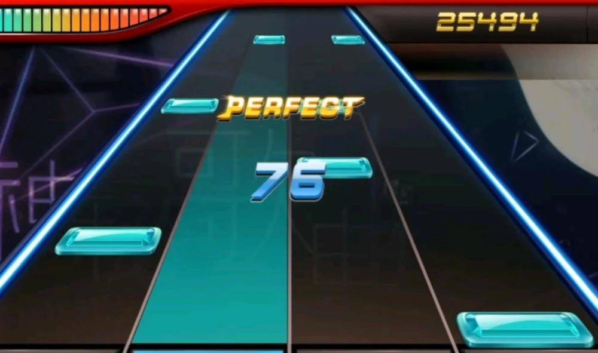

# CSE-230-Project-Rythm-Game
This repo is for CSE 230 project.
## Introduction
This project aims to build a keyboard controlled rhythm game with Haskell in brick.
## How to play the Game
The core gameplay of this rhythm game is a score-based music video game. As is shown in Fig 1., a bottom line is affixed at the bottom of the screen, and horizontal bars known as "notes" appear from the top of the screen and fall to the bottom line. The player presses the corresponding keys on the keyboard when the notes reach the bottom line in time with the background music, resembling playing a piano. 

The player's performance is scored by the timing of the hit, where the hits are categorized into “Charming”, “Excellent”, “Normal” and “Miss” by accuracy. The player gets different scores for these four levels. If you continuously hit without missing, the number of your continuous hits before the last miss is called “combos”. After you finish the song, there will be a result page showing your final score. The score is calculated on the overall performance. That is to say, the more accurately you tap the notes, the more scores you will get in the end. 

## Basic elements
1. Sound: The background music playing throughout the game.
2. Graphics: Notes that show up according to the rhythm.
3. Interaction: The score changes when the player presses the keys on the keyboard. 
## Goals
1. Show the start screen and menus.
2. Load and start playing the background music when a user begins the game.
3. Implement the user interface for hitting multiple notes via keyboard during the game.
4. Achieve the realtime scoring mechanism based on users’ interaction;
5. Show the final score at the result page. 

## Stretch goals
1. Implement multiple note types including short press, long press and combos.
2. Enable the result page to not only show the score but also show the proportion of "Charming" hits and the longest combo. And the score also is related to your longest “combo”s.
3. Add different levels of songs with different difficulties..
4. Add a new feature to allow multiple players to play this game at the same time.
APIs to import new music.

## Roadmap
1. Develop the UI interface with the brick library. The UI includes: the start screen of the game, a 4-column frame where notes are following to the bottom, the notes, the current score, comments for each hit, the result page.
2. Develop the business logic of this game: playing music during the game, generating the notes based on the rhythm, calculating the score.
3. Conduct unit tests for each component.
4. Develop new features for stretch goals with unit tests if possible. Wrap up the whole project, prepare for demonstration.

## Reference
https://hackage.haskell.org/package/rhythm-game-tutorial

https://fumieval.github.io/rhythm-game-tutorial/

https://github.com/fumieval/rhythm-game-tutorial

https://en.wikipedia.org/wiki/Deemo
